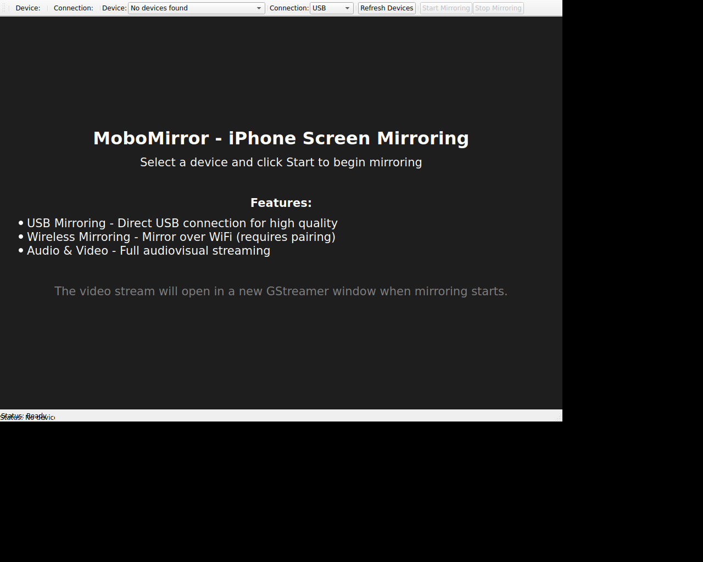

# MoboMirror Qt Application

This is a Qt6 GUI application for mirroring iPhone screens over USB and wireless connections.



## Features

- **USB Mirroring**: High-quality screen mirroring via direct USB connection
- **Wireless Mirroring**: Mirror over WiFi network (requires device pairing)
- **Device Discovery**: Automatically detects connected iOS devices
- **Audio & Video**: Full audiovisual streaming support
- **Cross-platform**: Works on Linux, macOS, and other Unix-like systems

## Prerequisites

### Dependencies

- Qt 6.x (Core, Widgets, Multimedia)
- libusb-1.0
- GStreamer 1.0 and plugins
- pkg-config

### On Ubuntu/Debian:

```bash
sudo apt-get install qt6-base-dev qt6-multimedia-dev libusb-1.0-0-dev \
    libgstreamer1.0-dev libgstreamer-plugins-base1.0-dev \
    gstreamer1.0-plugins-base gstreamer1.0-plugins-good \
    gstreamer1.0-plugins-bad gstreamer1.0-plugins-ugly \
    libglib2.0-dev pkg-config
```

### On macOS:

```bash
brew install qt6 libusb pkg-config gstreamer gst-plugins-bad \
    gst-plugins-good gst-plugins-base gst-plugins-ugly
```

## Building

### Build the Go Backend

First, build the Go backend (`qvh`) in the root directory:

```bash
cd /path/to/MoboMirror
go build -o qvh
```

### Build the Qt Application

```bash
cd qt-app
mkdir build
cd build
qmake6 ..
make
```

The executable will be created as `MoboMirror` in the `build` directory.

## Running

After building, run the application:

```bash
cd qt-app/build
./MoboMirror
```

**Note**: The application expects the `qvh` binary to be in the parent directory (`../qvh`).

## Usage

1. **Connect your iPhone**: Plug in your iPhone via USB or ensure it's on the same WiFi network
2. **Trust the computer**: On first connection, trust the computer on your iPhone
3. **Select device**: Choose your device from the dropdown
4. **Choose connection type**: Select USB or Wireless
5. **Start mirroring**: Click "Start Mirroring"
6. **Stop mirroring**: Click "Stop Mirroring" when done

## How It Works

The Qt application provides a user-friendly interface that:

1. Uses the Go backend (`qvh`) to communicate with iOS devices
2. Discovers connected devices using the `devices` command
3. Activates QuickTime device configuration for screen capture
4. Launches GStreamer to display the video stream in a new window
5. Manages the mirroring process lifecycle

## USB Mirroring

USB mirroring uses the hidden QuickTime device configuration on iOS devices:

- Highest quality streaming
- Lower latency
- Direct USB connection
- Works offline

## Wireless Mirroring

Wireless mirroring uses the usbmuxd network tunnel feature:

- Requires device to be paired with the computer
- Device and computer must be on the same network
- Slightly higher latency than USB
- More convenient for demo/presentation scenarios

**Note**: Wireless mirroring implementation is still under development. For best results, use USB mirroring.

## Troubleshooting

### Device not detected

- Ensure iPhone is unlocked and "Trust This Computer" is confirmed
- Check USB cable connection
- Try running `qvh devices` from command line to verify backend works

### Mirroring fails to start

- Make sure GStreamer is properly installed
- Verify the `qvh` binary is accessible
- Check that you have necessary USB permissions (may need udev rules on Linux)

### Permission errors on Linux

Create a udev rule for libusb access:

```bash
sudo nano /etc/udev/rules.d/70-iphone.rules
```

Add:

```
SUBSYSTEM=="usb", ATTR{idVendor}=="05ac", ATTR{idProduct}=="12a8", MODE="0666"
SUBSYSTEM=="usb", ATTR{idVendor}=="05ac", ATTR{idProduct}=="12ab", MODE="0666"
```

Then reload:

```bash
sudo udevadm control --reload-rules
sudo udevadm trigger
```

## Architecture

```
┌─────────────────────┐
│   Qt GUI (C++)      │
│   - Device list     │
│   - Controls        │
│   - Status display  │
└──────────┬──────────┘
           │
           │ QProcess
           ▼
┌─────────────────────┐
│   Go Backend (qvh)  │
│   - USB/libusb      │
│   - Device control  │
│   - Stream capture  │
└──────────┬──────────┘
           │
           │ Pipes
           ▼
┌─────────────────────┐
│   GStreamer         │
│   - H.264 decode    │
│   - Audio decode    │
│   - Video display   │
└─────────────────────┘
```

## License

This project uses the same license as the parent MoboMirror project.

## Credits

Built on top of the excellent [quicktime_video_hack](https://github.com/danielpaulus/quicktime_video_hack) by Daniel Paulus.
